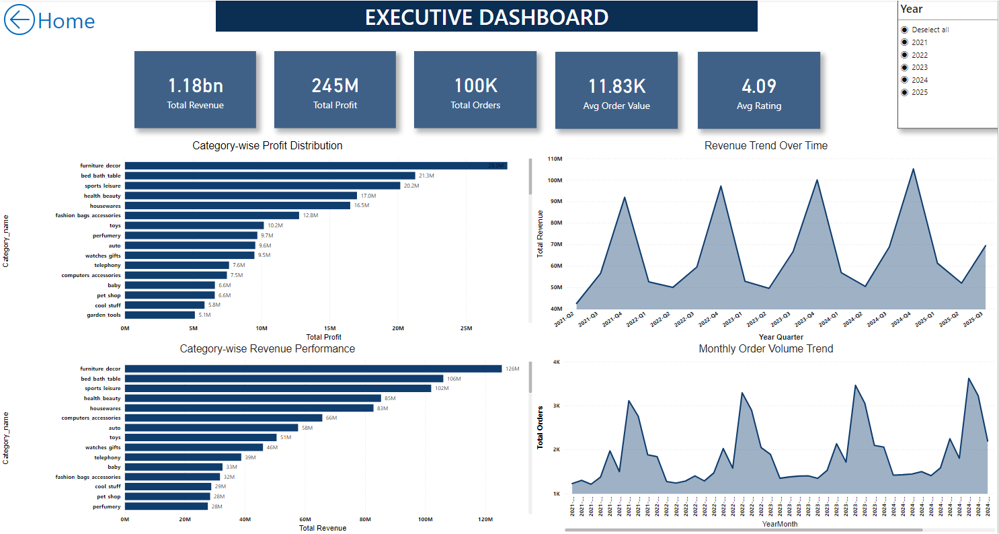
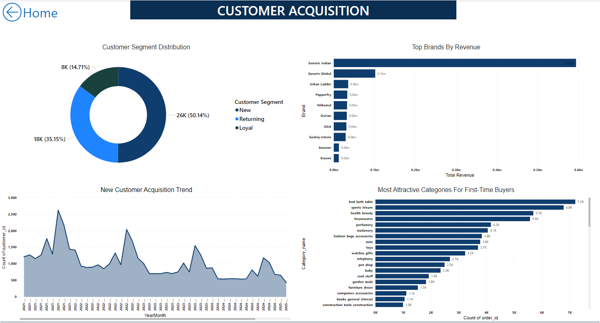
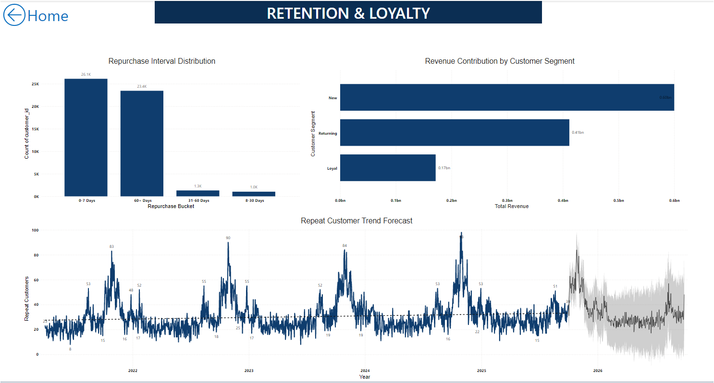
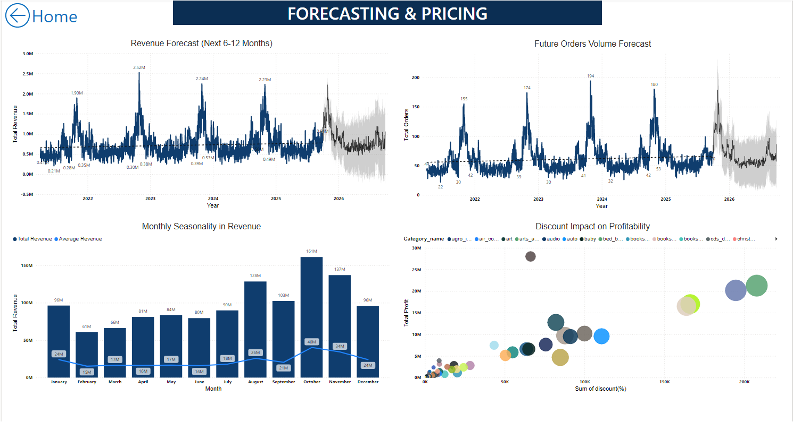

# E-Commerce Customer Analytics & Business Intelligence

## Executive Summary

This project demonstrates an end-to-end Data Analytics solution developed to analyze customer behavior, sales performance, and business operations within an e-commerce environment.

Using SQL, Python, Power BI, and Machine Learning, the project transforms raw transactional data into actionable business insights through data cleaning, exploratory analysis, dashboard development, predictive modeling, and business recommendations.

The objective is to support data-driven decision-making that improves customer understanding, operational efficiency, and overall business performance.

## Project Highlights

This project demonstrates a complete end-to-end Business Analytics workflow by integrating multiple technologies into a single business solution.

### Key Deliverables

- Designed and optimized a relational database using MySQL.
- Automated business logic using SQL Views, Stored Procedures, and Triggers.
- Performed data preprocessing and exploratory data analysis using Python.
- Applied statistical techniques to validate business insights.
- Developed machine learning models for customer behavior analysis and forecasting.
- Built an interactive multi-page Power BI dashboard for executive reporting.
- Generated business recommendations to support strategic decision-making.

## Dashboard Preview

The project includes an interactive multi-page Power BI dashboard designed to support business decision-making across customer acquisition, retention, revenue analysis, forecasting, and operational performance.

### Executive Dashboard



### Customer Acquisition Dashboard



### Retention & Loyalty Dashboard



### Forecasting & Pricing Dashboard



## Business Problem

Modern e-commerce businesses generate large volumes of transactional and customer data. However, without effective analysis, valuable business opportunities often remain hidden.

This project focuses on transforming raw business data into meaningful insights that help answer critical business questions such as:

- Which customer segments contribute the highest business value?
- Which product categories drive revenue and profitability?
- How do discounts influence customer purchasing behavior?
- Which operational challenges impact customer satisfaction and retention?
- How can data-driven insights improve strategic business decisions?

## Project Objectives

The primary objectives of this project are to:

- Clean and prepare raw e-commerce data for analysis.
- Perform Exploratory Data Analysis (EDA) to identify business trends.
- Design and query a MySQL database for efficient data management.
- Build interactive Power BI dashboards for business reporting.
- Apply Machine Learning models to generate predictive insights.
- Provide actionable business recommendations based on data analysis.

## Technology Stack

| Category | Tools & Technologies |
|----------|----------------------|
| Programming Language | Python |
| Database | MySQL |
| Data Analysis | Pandas, NumPy |
| Data Visualization | Power BI |
| Machine Learning | Scikit-learn |
| Statistical Analysis | Probability, T-Test, Chi-Square |
| Development Environment | Jupyter Notebook, VS Code |
| Version Control | Git & GitHub |

## Project Workflow

1. Data Collection
2. Data Cleaning & Preprocessing
3. Exploratory Data Analysis (EDA)
4. Statistical Analysis
5. SQL Database Design & Automation
6. Interactive Power BI Dashboard Development
7. Machine Learning Model Development
8. Business Insights & Recommendations

## Key Business Insights

- Customer retention is strongest during the early purchase lifecycle, highlighting the importance of onboarding strategies.
- Revenue is concentrated in a few high-performing product categories, while profitability varies significantly across categories.
- Medium discount strategies (11–25%) provide the best balance between revenue generation and profitability.
- Delivery delays remain the biggest operational challenge despite consistently high customer satisfaction ratings.
- Machine Learning models successfully identified customer segments and repeat purchase patterns to support targeted business strategies.

## Business Recommendations

Based on the analysis, the following recommendations were identified:

- Strengthen customer retention strategies by targeting high-value customer segments.
- Optimize inventory planning using sales and demand trends.
- Improve product performance through category-wise sales analysis.
- Monitor business KPIs using interactive Power BI dashboards.
- Support data-driven decision-making through predictive analytics and business intelligence.

## Repository Structure

```text
ecommerce-customer-analytics-business-intelligence/
│
├── data/
│   ├── raw/
│   └── processed/
├── sql/
├── python/
├── powerbi/
├── dashboard-screenshots/
├── presentation/
├── README.md
├── LICENSE
└── .gitignore
```
